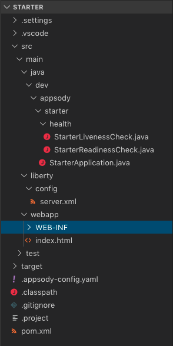
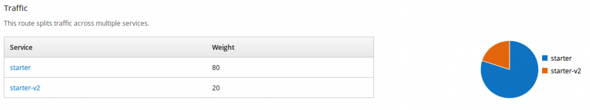
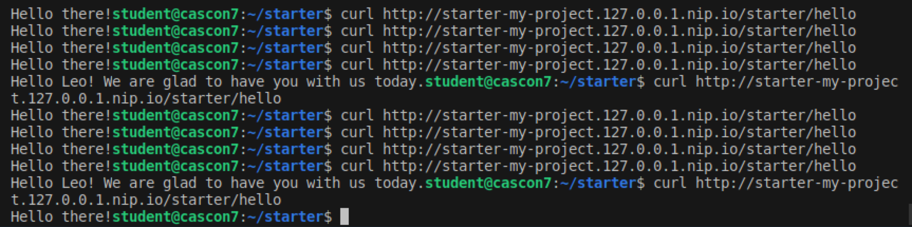
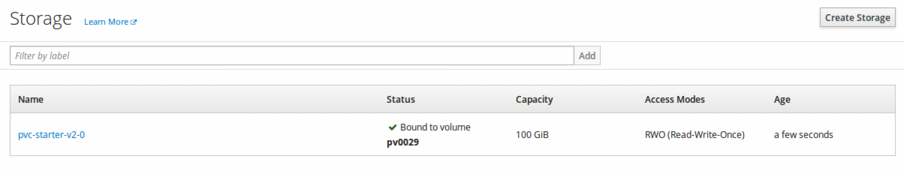
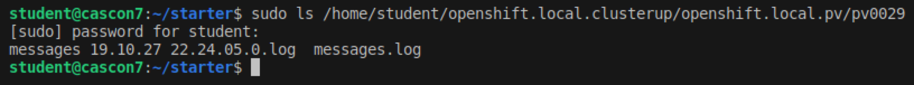

# Compose a Cloud-Native Masterpiece with Appsody

This lab demonstrates developing and deploying enterprise-grade, cloud-native applications using [Appsody](https://appsody.dev).


## Connect to the VM

For the workshop at CASCON x EVOKE 2019, we have prepared some virtual machines (VM) with the necessary pre-requisites. You can borrow a VM from us to complete the lab.

Make sure you are connected to wireless network `Classroom`. Password is `cas-ibm-19`. The VMs will only be available through it.

Use `MicroSoft Remote Desktop` client to connect to the VM we provided to you.

## Pre-requisites:

- [Appsody](https://appsody.dev) : install in a few easy steps by following the instructions [here](https://appsody.dev/docs/getting-started/installation/)
- [OKD](https://www.okd.io/) : The Origin Community Distribution of Kubernetes that powers Red Hat OpenShift. Download from [here](https://www.okd.io/download.html#oc-platforms)
- [Docker](https://www.docker.com/) : install from [here](https://docs.docker.com/install/)
- [Visual Studio Code](https://code.visualstudio.com/)


## Start OpenShift cluster

Open the terminal using the shortcut to `MATE Terminal` on desktop. The terminal should open in the student folder (_/home/student_)

Start the OpenShift Cluster by running: 

```bash
oc cluster up 
```

The cluster will take around 5 minutes to be available. While it's starting you can continue with rest of the lab. 


## Hands-on with Appsody

### Find Appsody stacks

Open another terminal window.

Run the following command to see the list of Appsody stacks available to you:

```
appsody list
```
  
You would get an output similar to this:

```
REPO        	ID                       	VERSION  	TEMPLATES        	DESCRIPTION                                              
*appsodyhub 	java-microprofile        	0.2.18   	*default         	Eclipse MicroProfile on Open Liberty & OpenJ9 using Maven
*appsodyhub 	java-spring-boot2        	0.3.15   	*default, kotlin 	Spring Boot using OpenJ9 and Maven                       
*appsodyhub 	kitura                   	0.2.1    	*default         	Runtime for Kitura applications                          
*appsodyhub 	nodejs                   	0.2.5    	*simple          	Runtime for Node.js applications                         
*appsodyhub 	nodejs-express           	0.2.8    	scaffold, *simple	Express web framework for Node.js                        
*appsodyhub 	nodejs-loopback          	0.1.5    	*scaffold        	LoopBack 4 API Framework for Node.js                     
*appsodyhub 	python-flask             	0.1.5    	*simple          	Flask web Framework for Python                           
*appsodyhub 	starter                  	0.1.1    	*simple          	Runnable starter stack, copy to create a new stack       
*appsodyhub 	swift                    	0.2.0    	*simple          	Runtime for Swift applications                           
experimental	java-spring-boot2-liberty	0.1.10   	*default         	Spring Boot on Open Liberty & OpenJ9 using Maven         
experimental	nodejs-functions         	0.1.5    	*simple          	Serverless runtime for Node.js functions          
...
...
```

These stacks are available from Appsody repositories. You can see the list of repositories by running:

```
appsody repo list
```

You will get an output similar to this:

```
NAME        	URL                                                                               
*appsodyhub 	https://github.com/appsody/stacks/releases/latest/download/incubator-index.yaml   
experimental	https://github.com/appsody/stacks/releases/latest/download/experimental-index.yaml
```

`*appsodyhub` is the location where the Appsody project releases its stacks. The `*` indicates that this is the default repository. The `experimental` repo contains the stacks that are in experimental stage (not yet official).

---

### Explore an Appsody stack

Appsody supports curating existing application stacks for your needs as well as creating new stacks from scratch. This feature is very useful for Enterprise Architects who wants to help developers in their organization get started with writing cloud-native applications, without needing much knowledge about Docker or Kubernetes. At the same time, Enterprise Architects can define the enterprise image and policies everyone in their organization must use and abide by. End result is consistency in the way applications are developed and deployed. The customized stacks can then be hosted in internal repositories for the developers in the organization to consume.

Let's look at the [java-microprofile stack](https://github.com/appsody/stacks/tree/master/incubator/java-microprofile/image/project) as an example. An Enterprise Architect can customise the [Dockerfile](https://github.com/appsody/stacks/blob/master/incubator/java-microprofile/image/project/Dockerfile). For example, they can enable TLS/SSL for security reasons and monitoring for observability reasons. Liberty allows to easily enable [enterprise functionalities](https://github.com/OpenLiberty/ci.docker#enterprise-functionality) inside Dockerfile.

---

### Create a new project with Appsody

Let's create a directory named `starter` and navigate to it in terminal by running the following commands:

```
mkdir starter
cd starter
```

Let's create a new project using the `java-microprofile` stack, which uses the Java MicroProfile APIs and will run on the open-sourced Open Liberty runtime.

```
appsody init java-microprofile
```

Appsody will download the stack, build and run it. Wait for `Successfully initialized Appsody project` message.

---

### Explore the Appsody project in Visual Studio Code

Open the project in Visual Studio (VS) Code by running:

```
code .
```

VS Code will launch and display the files from the newly created project (on the left-side panel).

_Note:_ You can ignore and simply close any pop-ups in VS Code, including the ones that prompt to update any libraries.

Expand the `src` folder and you should see a file structure similar to this:



This project provides the necessary files to get started with writing a microservice in Java. It contains a JAX-RS Application class named _StarterApplication.java_, Liberty server configuration file named _server.xml_, a static welcome page named _index.html_ and the project build file _pom.xml_. Check out the content of those files.

In addition, the project also provides _StarterReadinessCheck.java_ and _StarterLivenessCheck.java_ which allows you to define the health definition for your application using [MicroProfile Health](https://microprofile.io/project/eclipse/microprofile-health). 

---

### Run the Appsody project in VS Code

In VS Code, from the top-menu, select `Terminal`, then `Run Task...` and then select `Appsody: run`

A terminal will open within VS Code. Appsody will download maven dependencies (which might take few minutes the first time), compile and run the starter application in a container. Wait for a message similar to this in the console: 

_The defaultServer server is ready to run a smarter planet. The defaultServer server started in 8.480 seconds._

Navigate to http://localhost:9080 in browser to see the welcome page with title `Welcome to your Appsody Microservice`

This welcome page content is provided by `src/main/webapp/index.html` in the `starter` project. The welcome page provides information on Appsody, MicroProfile and Open Liberty. Feel free to checkout those links.

If you navigate to the JAX-RS application endpoint http://localhost:9080/starter, you will get following message, because we haven't created any JAX-RS resources for the application:

_Error 500: javax.servlet.ServletException: At least one provider or resource class should be specified for application class "dev.appsody.starter.StarterApplication_

---

### Create a simple Hello Service

Let's create a new endpoint `/hello` to display message `Hello!`. 

Create a new file at `src/main/java/dev/appsody/starter/HelloService.java` with the following content. 

In VS Code, you can do this by right-clicking on the `starter` package and selecting `New File`, enter `HelloService.java` as file name and then copy the following content and save file (from drop-down menu select _File_ and then _Save_).

```java
package dev.appsody.starter;

import javax.ws.rs.Path;
import javax.ws.rs.GET;
import javax.ws.rs.Produces;
import javax.ws.rs.core.MediaType;

@Path("/hello")
public class HelloService {

  @GET
  @Produces(MediaType.TEXT_PLAIN)
  public String welcome(){
    return "Hello!";
  }
}
```

As soon as you save the file, the changes will be automatically picked up and the application will be updated. Wait for a message similar to the following in terminal (within VS Code):

_The application starter-app updated in 0.572 seconds._

Navigate to the Hello service at http://localhost:9080/starter/hello

You will get the message `Hello!`

_Optional_: If you change the welcome message to something else in HelloService.java, the changes will be picked up automatically as well. Wait for application to be updated and then refresh the page in browser to observe the changed message.

You just obeserved how easy it is to develop using Appsody, which provides various Application stacks to get you started in addition to an ideal development environment.

You ran the application locally within a container. Now let's deploy the application to the cloud.

First stop the Appsody run. In VS Code, from the top-menu, select `Terminal`, then `Run Task...` and then select `Appsody: stop`

Wait for the following message in terminal:

_Terminal will be reused by tasks, press any key to close it._

---

### Deploying to OpenShift cluster

We need the OpenShift cluster to be up and running for this portion of the lab and onwards. 

Ensure that the first command you ran, `oc cluster up`, to bring the OpenShift cluster completed in MATE terminal.

System Admin role is required to perform cluster operations. Login as admin by running the following command:

```
oc login -u system:admin
```

We'll use the terminal to run Appsody deploy command. There is a Task in VS Code for deploy just like run and stop, but we need to deploy with some custom configuration values.

It's easier to use the terminal within VS Code, rather than the MATE Terminal. This way you don't need to switch back and forth between VS Code and terminal window. To open a new terminal window in VS Code, select `Terminal` from the top-menu and then select `New Terminal`. 

Ensure you are in the `starter` folder in terminal. Enter `pwd` to confirm.

Request a new project:

```
oc new-project my-project
```

You should be automatically be switched to the newly created project `my-project`.

Let's build and deploy your Appsody project to your Kubernetes cluster.

Run the following command:

```bash
appsody deploy -t starter:v1 -n my-project
```

The Docker image name and tag are specified using the `-t` option. 

Appsody by default deploys to the `default` namespace. Hence, we used the `-n` option to specify the target namespace in your Kubernetes cluster, which is `my-project` (same as project name). 

Wait for the command to complete. You will see the following message at the end:

_Deployed project running at starter-my-project.127.0.0.1.nip.io_

In browser, navigate to the link provided by the above message. You should see the welcome page. Next, append `/starter/hello` to the URL and you will be greeted with message `Hello!` (or the custom message you entered). The behaviour is exactly same as what you observed locally with Appsody run. You just focused on writing the code and Appsody took care of the rest. 

Appsody, first extracted the code from your project and then built a local Docker image for deployment. It generated a deployment manifest file named `app-deploy.yaml`. In VS Code, open `app-deploy.yaml` (it's just above `pom.xml` - towards the bottom). Observe that it specified the application image using the `applicationImage` field - same as what you entered using `-t` option earlier. It also specified the readiness and liveness probes. In addition, it also set the `expose` field to true. This allows your application to be accessed by external users.

The Appsody CLI automatically installed the [Appsody Operator](https://github.com/appsody/appsody-operator) in your namespace. The Appsody Operator process the `AppsodyApplication` definition specified in `app-deploy.yaml` to deploy your image to OpenShift cluster.

---

### Update the application

Let's change HelloService to display a personal message, as opposed to a generic `Hello!`. Let's change it so that the message includes the name of the user. We'll use [MicroProfile Config](https://microprofile.io/project/eclipse/microprofile-config) to inject the user name via environment variable at runtime.

In VS Code, open `HelloService.java` and update it with the following content:

```java
package dev.appsody.starter;

import javax.ws.rs.Path;
import javax.ws.rs.GET;
import javax.ws.rs.Produces;
import javax.ws.rs.core.MediaType;
import javax.inject.Inject;

import org.eclipse.microprofile.config.inject.ConfigProperty;
import org.eclipse.microprofile.openapi.annotations.Operation;
import org.eclipse.microprofile.openapi.annotations.responses.APIResponse;

@Path("/hello")
public class HelloService {

  @Inject
  @ConfigProperty(name="USER_NAME", defaultValue="there")
  private String userName;

  @GET
  @Produces(MediaType.TEXT_PLAIN)
  @Operation(summary = "Welcome the user")
  @APIResponse(description = "Message for greeting the user")
  public String welcome(){
    return "Hello " + userName + "! We are glad to have you join us today.";
  }
}
```

We created a variable named `userName` which will automatically get injected with a value if a value for `USER_NAME` is specified in any config source, such as environment variables. 

[MicroProfile OpenAPI](https://microprofile.io/project/eclipse/microprofile-open-api) allows to document your APIs as well as discover other APIs. It automatically understands JAX-RS annotations and creates a document. We've further enhanced it via OpenAPI annotations `@Operation` and `@APIResponse`. 

Ensure to save the changes to `HelloService.java` file.

_Optional_: You can test the changes locally using Appsody run task (as before).

---

### Deploy updated application

Let's release the updated application as `v2`. We'll do a new deployment.

Copy the following content to `app-deploy.yaml`:

```yaml
apiVersion: appsody.dev/v1beta1
kind: AppsodyApplication
metadata:
  name: starter-v2
spec:
  # Add fields here
  version: 2.0.0
  applicationImage: starter:v2 
  stack: java-microprofile
  env:
    - name: USER_NAME
      value: Leo
  #storage:
    #size: 500Mi
    #mountPath: /logs
  service:
    type: NodePort
    port: 9080
    annotations:
      prometheus.io/scrape: 'true'
  readinessProbe:
    failureThreshold: 12
    httpGet:
      path: /health/ready
      port: 9080
    initialDelaySeconds: 5
    periodSeconds: 2
  livenessProbe:
    failureThreshold: 12
    httpGet:
      path: /health/live
      port: 9080
    initialDelaySeconds: 5
    periodSeconds: 2
  expose: false
  createKnativeService: false
```

We've changed the value of `name` field (under `metadata`) from `starter` to `starter-v2`. We also changed the value of `version` to `2.0.0` and value of `applicationImage` to `starter:v2`. 

We also set `expose` field to `false`. Let's pretend that we are not 100% confident that the new version v2 is ready to be rolled out to everyone. We want to test v2 with some real traffic before rolling it out to everyone. Hence,we are not exposing it directly.

We've also specified a value for `USER_NAME` under `env` field. Change it to your name. This value will be passed to the container and MicroProfile Config will inject the value to the HelloService at runtime. 

Leave the commented out `storage` field and its subfields as is for now. We'll enable it in the last section of the lab.

Ensure that you saved the changes to `app-deploy.yaml`.

To deploy the updated application, run the following command:

```
appsody deploy -t starter:v2 -n my-project
```

Wait for the command to complete. You will see a message similar to this (the port number might be different) :

_Deployed project running at http://:31989_

---

### Split traffic between v1 and v2

Navigate to the OpenShift Web Console: https://127.0.0.1:8443/console

If prompted to login, enter `developer` for both username and password. If prompted to select a project, select `my-project`.

Using the menu on the left-side, select `Applications` and then select `Routes`. 

Select `starter` from the list of routes.

From the `Actions` drop-down menu (on the right-hand side), select `Edit`.

From the `Alternate Services` section, select `Split traffic across multiple services` checkbox. From the newly displayed `Service` options select `starter-v2` 

Scroll down and move the slider under `Service Weights` to assign 80% traffic to `starter` (left-side) and 20% traffic to `starter-v2` (right-side)

Click on `Save`.

You should see traffic split information similar to this in the console: 



The route split between v1 and v2 is now set. 4/5 requests should now be sent to v1 and the rest to v2. Let's test using curl in terminal. The browser caches the output, so it's not reliable.

In terminal, enter the following command:

```
curl http://starter-my-project.127.0.0.1.nip.io/starter/hello
```

Repeat the command 10 times and observe that 80% of the time, the message comes from v1 of HelloService (just a Hello) and 20% of the time the message comes from v2 of HelloService (the message with user name).



Now that you've tested v2 with real traffic and it displays the output you expect, you feel more confident. Let's modify the split to be 50%/50%. 

As before, edit the `starter` route by selecting `Action` and then `Edit` and place the slider in the middle. Save the change.

Repeat the curl commands in terminal. Now, you'll observe that every other request goes to v2.

Now you have complete confidence in v2 of the application. So you are ready to roll it out to everyone. Let's expose it directly to users.

Open `app-config.yaml` and set `expose` to `true` and save the change. The application itself didn't change, so we will not modify other fields in the deployment metadata (i.e. version, applicationImage)

In terminal, run the following command:

```
appsody deploy -n my-project
```

Wait for the command to complete. You will see the following message at the end:

_Deployed project running at starter-v2-my-project.127.0.0.1.nip.io_

In browser, navigate to the link provided by above message. You should see the welcome page. Next, append `/starter/hello` to the URL and you will be greeted with a personalized message that includes the user name you specified. 

New version of the application, v2, is now exposed.

We can now delete the initial version of application `starter`. Run the following command:

```
oc delete appsodyapplication starter -n my-project
```

---

### Explore Health, API and Metrics endpoints

Navigate to the Health endpoint starter-v2-my-project.127.0.0.1.nip.io/hello. You'll see that liveness, readiness and overall status are reported as `UP`. This is reported by _StarterReadinessCheck.java_ and _StarterLivenessCheck.java_ you previously explored. Kubernetes continiously monitors the health of the application and if health checks were to fail, Kubernetes will automatically take necessary actions such as stop sending requests to microservice and restarting microservice if failures exceed defined threshold.

Next, navigate to the OpenAPI endpoint starter-v2-my-project.127.0.0.1.nip.io/openapi/ui. You'll see information about some API endpoints that are available.

Navigate to the _Application Metrics for Java_ endpoint starter-v2-my-project.127.0.0.1.nip.io/javametrics-dash. You will see a dashboard with various metrics. It'll be empty. Let's populate it with some data. In a separate tab, navigate to the `/starter/hello` endpoint as you did before. Refresh it 5-10 times with at least a second delay in between. Go back to the dashboard to see some metrics information such as HTTP requests average response time, throughput, CPU/heap usage and garbage collection time. Switch to the `Summary` tab and see information about HTTP requests.


You didn't have to enable or configure anything to get the health, API or metrics information. It was automatically enabled and configured by the Appsody's stack `java-microprofile`. Similarly, other Application Stacks from Appsody provide useful functionalities by default. So developers can just focus on writing code.

---

### Bonus: Enabling persistence

Data from the container will be lost when the container is stopped, so it is very important to persist critical data by storing them outside the container or the pod running them.

Open `app-config.yaml` and uncomment the `storage` field and its sub-fields, `size` and `mountPath`, by deleting the `#` character at the beginning of those three lines.

The `size` field is convenient to set the size of the persisted storage. The `mountPath` specifies the location of the data inside the container to persist. In this exercise, we'll persist the logs written by Liberty server to `/logs`. 

_Additional information:_ In this case, Appsody Operator will automatically create a _PersistentVolumeClaim_. Appsody Operator also allows users to provide entire _volumeClaimTemplate_ for full control over automatically created _PersistentVolumeClaim_.

In terminal, run the following command:

```
appsody deploy -n my-project
```

Wait for the command to complete. 

In OpenShift Web Console, select `Applications` from the menu on the left-side and then select `Stateful Sets`. You should see a Stateful Set for your application, named `starter-v2`.

Click on `Storage` from the side-menu and you should see a _PersistentVolumeClaim_ named `pvc-starter-v2-0`.



The `Status` column should state _Bound to volume_ along with a persistent volume ID (in bold letters). Make a note of the persistent volume ID (PV_ID). In above example, PV_ID is pv0029.

The files from the `/logs` directory inside the container should now be available in the persistent volume. 

The OpenShift cluster created some persistent volumes by default on the local file system which is used in this case. But they are owned by root. So we would need to use _sudo_ in the command. In real world scenarios, using an external storage solution such as NFS or GlusterFS would be ideal. 

Let's list the files from the persistent volume folder. In the following command, replace `PV_ID` with the value you noted down earlier:

```
sudo ls /home/student/openshift.local.clusterup/openshift.local.pv/PV_ID
```

Enter the password `cas2019con`

You should see one or more message logs, similar to this:



The logging data is now persisted. Even if the container is stopped or crashes or the entire application is deleted, the data will still be available. 

## Optional: Clean up

Delete the application:

```
oc delete appsodyapplication starter-v2 -n my-project
```

Delete the Appsody Operator:

```
oc delete deploy appsody-operator -n my-project
```

Stop OpenShift cluster:

```
oc cluster down
```

---

**Congratulations! You've completed the lab!**
